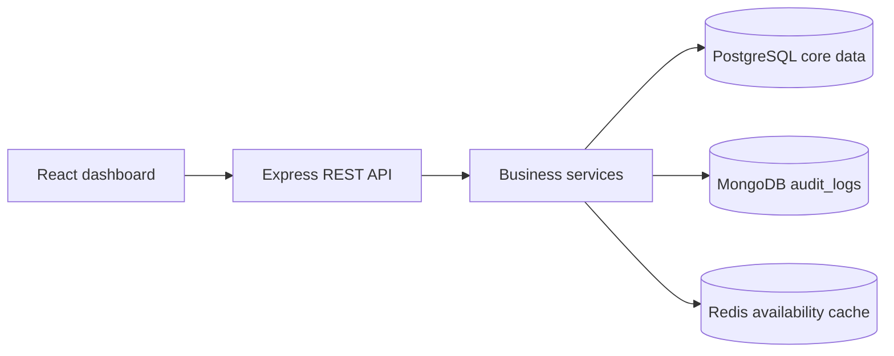

# System Design

## HLD

The React client calls stateless Express REST endpoints. Controllers validate and delegate to services. PostgreSQL owns users, vehicles, slots, and tickets. MongoDB stores append-only operational audit events. Redis caches the availability read model and is invalidated after successful park and exit transactions.

## Transaction boundary

Parking and exit each use one PostgreSQL transaction. Parking locks the first available slot with `SELECT ... FOR UPDATE`, creates the ticket, marks the slot occupied, and commits. Exit locks the ticket, marks it completed, releases the slot, and commits. Redis is invalidated only after commit, so PostgreSQL remains authoritative.

## Scaling

The API is stateless and can run behind a load balancer. PostgreSQL connection pooling, indexes, paginated history, Redis reads, and MongoDB audit writes keep the core path bounded. At higher traffic, use a managed PostgreSQL primary with read replicas for reporting, a highly available Redis deployment, and a MongoDB replica set. Slot allocation must continue to route to the transactional PostgreSQL primary.

## Security

Passwords are bcrypt hashes, sessions are signed JWTs, request bodies are Joi validated, SQL uses parameterized queries, and MongoDB writes use structured driver APIs. Authentication and parking writes are rate limited. Secrets are loaded from `.env` and excluded from source control.
